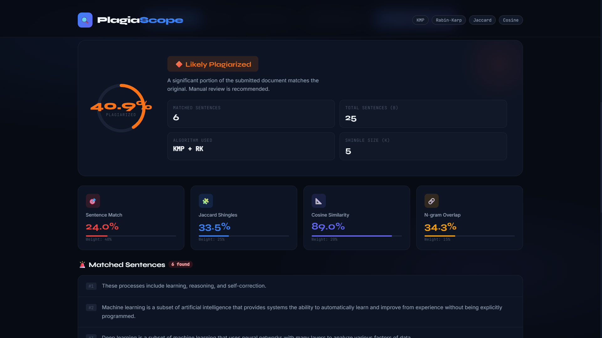
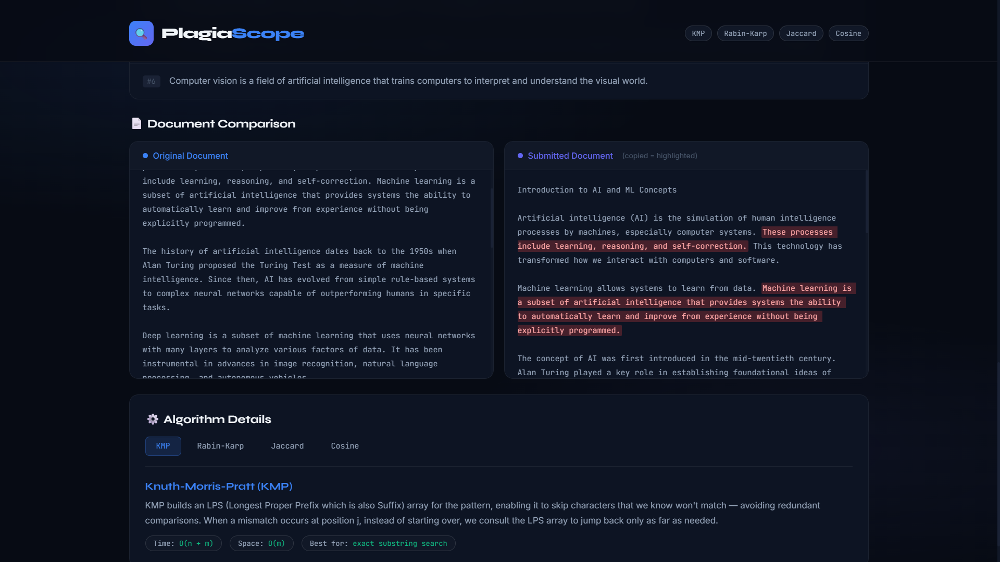
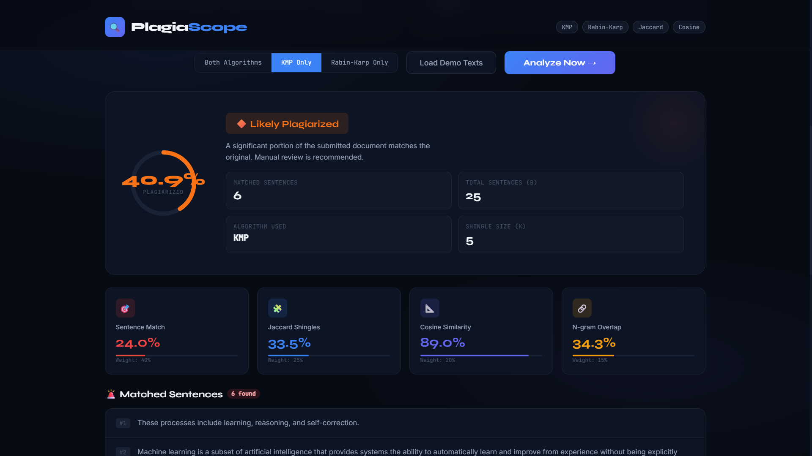
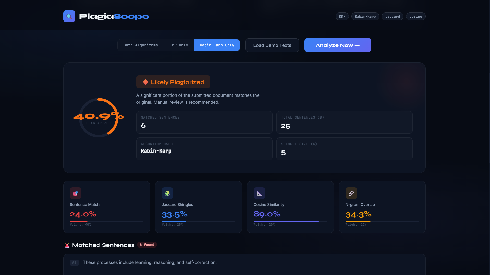

# 🔍 PlagiaScope — Plagiarism Detector Using String Matching Algorithms

<p align="center">
  
  
  
  
</p>


## 📌 Problem Statement

Plagiarism is a major challenge in academia, publishing, and content creation. Manual comparison of documents is slow, error-prone, and impossible at scale. This project builds a **multi-algorithm plagiarism detection pipeline** using classical DSA concepts to detect exact copies, near-duplicates, and paraphrased content.

---

## 🧠 DSA Concepts Demonstrated

| Concept | Where Used |
|---|---|
| KMP failure function (LPS array) | Exact sentence matching |
| Rabin-Karp rolling hash | Sliding-window multi-pattern search |
| Set intersection / union | Jaccard shingle similarity |
| Dot product / vector norms | Cosine TF similarity |
| Hashing (HashMap) | N-gram overlap counting |
| String manipulation | Preprocessing, cleaning |
| Sliding window | Shingle generation, rolling hash |

---

## ✨ Features

- ✅ **KMP Algorithm** — O(n+m) exact string/sentence matching
- ✅ **Rabin-Karp** — O(1) rolling hash; supports multi-pattern search
- ✅ **Jaccard Similarity** — character k-shingle set overlap
- ✅ **Cosine Similarity** — TF-vector angle measurement
- ✅ **N-gram Overlap** — phrase-level paraphrase detection
- ✅ **Weighted Plagiarism Score** — combined multi-metric verdict
- ✅ **Web Dashboard** — drag-and-drop UI with live results
- ✅ **Reports** — TXT, HTML (highlighted), JSON output
- ✅ **CLI** — scriptable command-line interface

---

## 📁 Folder Structure

```
Plagiarism-Detector-String-Matching/
│
├── documents/              # Sample documents
│   ├── original.txt        # Reference / original document
│   └── submitted.txt       # Submitted / suspect document
│
├── src/                    # Core algorithm modules
│   ├── __init__.py
│   ├── kmp.py              # KMP algorithm + LPS builder
│   ├── rabin_karp.py       # Rabin-Karp rolling hash
│   ├── preprocessor.py     # Text cleaning, tokenization, shingling
│   ├── similarity.py       # Jaccard, Cosine, Sentence, N-gram scoring
│   └── reporter.py         # TXT / HTML / JSON report generation
│
├── outputs/                # Generated reports (auto-created)
├── images/                 # Screenshots for README
├── reports/                # Manually saved sample reports
├── docs/                   # Project documentation
│
├── main.py                 # CLI entry point
├── dashboard.html          # Web UI (open in browser, no server needed)
├── requirements.txt        # Python dependencies (all stdlib)
├── .gitignore
└── README.md
```

---

## 🚀 How to Run

### 1. Clone the repository
```bash
git clone https://github.com/YOUR_USERNAME/Plagiarism-Detector-String-Matching.git
cd Plagiarism-Detector-String-Matching
```

### 2. Python 3.10+ required (no pip installs needed!)
```bash
python --version   # must be 3.10+
```

### 3. Run with demo documents
```bash
python main.py
```

### 4. Run with your own documents
```bash
python main.py -a documents/original.txt -b documents/submitted.txt
```

### 5. Use a specific algorithm
```bash
python main.py --algorithm kmp
python main.py --algorithm rabin_karp
```

### 6. Open the Web Dashboard
```
Open dashboard.html in any browser (Chrome/Firefox/Edge).
No server needed — it's a standalone HTML file.
```

---

## 📊 Sample Output

```
╔══════════════════════════════════════════════════════╗
║        PLAGIARISM DETECTOR  v1.0                     ║
║        KMP · Rabin-Karp · Jaccard · Cosine           ║
╚══════════════════════════════════════════════════════╝

  ✓  Reading and preprocessing documents
  ✓  Running KMP string matching algorithm
  ✓  Running Rabin-Karp rolling hash
  ✓  Computing similarity metrics
  ✓  Generating reports

════════════════════════════════════════════════════════
   PLAGIARISM DETECTION REPORT
════════════════════════════════════════════════════════

  METRIC SCORES
  Sentence Match   :   24.0%  (weight 40%)
  Jaccard Shingles :   33.5%  (weight 25%)
  Cosine Similarity:   89.0%  (weight 20%)
  N-gram Overlap   :   34.3%  (weight 15%)

  PLAGIARISM : 40.9%
  [████████████████████░░░░░░░░░░░░░░░░░░░░░░░░░░░░░░]
  VERDICT    : 🔶 LIKELY PLAGIARIZED
```

---
## 📊 Screenshots

## Dashboard


## Kmp && Rabin_Karp


## Doc_comparision


## Kmp 


## Rabin_Karp 


---

## 🔬 Algorithm Explanations

### KMP (Knuth-Morris-Pratt)
Builds an LPS array to avoid redundant comparisons. When a mismatch occurs at character j in the pattern, instead of restarting, we jump to `lps[j-1]`. This guarantees each character is visited at most twice → **O(n + m)**.

### Rabin-Karp
Uses a polynomial rolling hash: `H = (H × BASE + char) mod PRIME`. Sliding the window is O(1) per step. Collisions are resolved by character comparison. Especially powerful for **multi-pattern search**.

### Jaccard Similarity
Documents become sets of k-character shingles. `J(A,B) = |A ∩ B| / |A ∪ B|`. Detects near-duplicates even after minor edits.

### Cosine Similarity
Documents become term-frequency vectors. `cos(θ) = dot(A,B) / (‖A‖ × ‖B‖)`. Length-invariant — works even when one document is much longer.

---

## 🏆 Verdict Thresholds

| Plagiarism % | Verdict |
|---|---|
| < 15% | ✅ Original |
| 15 – 40% | ⚠️ Suspicious |
| 40 – 70% | 🔶 Likely Plagiarized |
| > 70% | 🚨 Plagiarized |

---

## 💼 Learning Outcomes

- Implemented KMP from scratch with LPS array construction
- Implemented Rabin-Karp rolling hash for O(1) window updates
- Applied set theory (Jaccard) and linear algebra (Cosine) to NLP
- Built a complete text preprocessing pipeline
- Generated multi-format reports (TXT, HTML, JSON)
- Designed a clean CLI and interactive web dashboard

---

## 🎯 Interview Preparation

**Q: Explain your project.**
> "This project detects plagiarism using a layered pipeline. I implemented KMP for O(n+m) exact sentence matching, Rabin-Karp rolling hash for multi-pattern search, Jaccard similarity on character shingles for near-duplicate detection, and cosine similarity on TF-vectors for vocabulary comparison. A weighted combination of all four gives the final plagiarism percentage. I also built a web dashboard that runs entirely in the browser with no backend required."

**Q: Why KMP over naive search?**
> Naive search is O(n×m). KMP precomputes an LPS array in O(m) that tells us how far to jump back on a mismatch, giving O(n+m) total — a significant improvement for long documents.

**Q: What is the rolling hash in Rabin-Karp?**
> Instead of recomputing the hash of every new window from scratch (O(m) each), we drop the leftmost character and add the new rightmost character in O(1): `H_new = (BASE × (H_old − text[i] × h) + text[i+m]) mod PRIME`.

---

## 👤 Author

**Amiya Krishna Chaurasiya** — DSA Course Project  

GitHub: [@Amiya-Krishna](https://github.com/Amiya-Krishna)

LinkedIn: [@Amiya Krishna](www.linkedin.com/in/amiya-krishna)
---

## 📄 License

MIT License — free to use, modify, and distribute.
